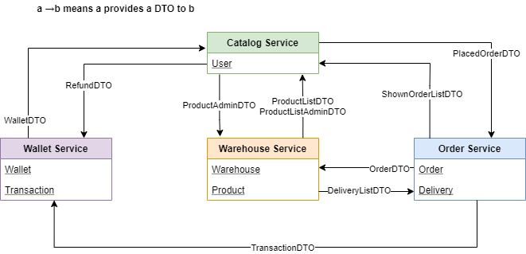
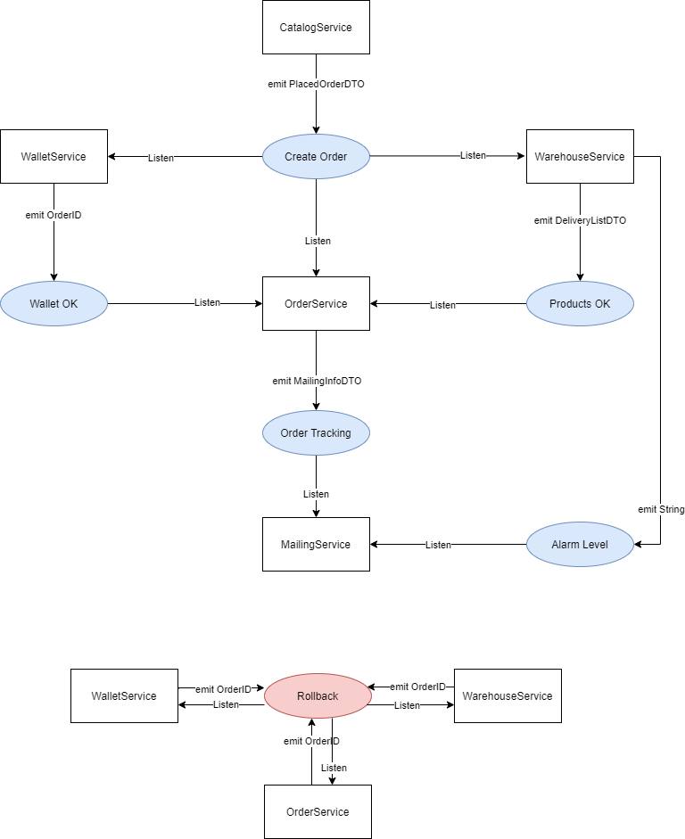

# eCommerce API

#### Advanced programming project of the Master in AI & Cloud - PoliTO Reply

eCommerce APi is an headless (just API) eCommerce web application powered by Spring boot, with a microservice
architecture.

## Services

### Description

The application is composed by the following services.

#### Catalog Service

Customers interact with this service only. They can list products, get their features and availability (availability
comes from warehouses). To each user we associate a wallet they can use to purchase products. Customer can place any
order, given there is enough money in their wallet and the products are available in the warehouses. As result they
receive and Order object with a tracking id they can use to check the status or cancel the order until shipping is not
started. Customers also receive an email each time their order is updated. Admins can add and edit product properties.
Both Customers and Admins already have an account using their email is the username. For simplicity this is the only
service handling authentication.

#### Order Service

It is the core of the system. It stores orders and their status and it is responsible of enforcing the rules on orders.
Orders can be placed only if the customer has enough money in his/her wallet and products are available in warehouses.
Order placing and all the related operations should be atomically isolated at a global level and be transactional, i.e.
if some service fails, for any reason, every other operation already done must be rolled back (see later for details).
After the purchase, the order status must be updated accordingly to the progress (picked up from the warehouse, shipping
in progress, shipped, canceled, error - you can choose any set of states useful for modeling order handling) and admins
and users must be notified via an email In case of fail or when an order is canceled the customer must be rechargeed and
the items must be returned to the warehouse. This service APIs can be used only by other internal services (all services
are considered trusted and they can perform any operation). Customers and Admins can query and modify order status only
through the the CatalogService accordingly to their permissions.

#### Wallet Service

Wallets handle customer money, they have simple API: you can query the total, the transaction list, and add a
transaction. Negative transaction are issued during purchase, positive ones
(recharges) are issued by admins only.

#### Warehouse Service

It handles the list of products stored in any warehouse. Products can be in more than one warehouse, with different
quantities. Each warehouse has list of alarm levels for any product; when the quantity of product is below the alarm
level a notification must be sent to the admins The APIs allows the listing of products and their quantities, loading
and unloading items and updating alarms. For simplicity you can use a single WarehouseService handling more than one
warehouse, but in real life there can a separate instance for each warehouse.

## Architecture

The proposed API comes in two flavours:

1. Synchronous architecture: The communication among the microservices is based on REST endpoints.
2. Asynchronous architecture: The communication among the microservices is managed by an external publisher-subscriber
   system, in this case Kafka.

The two types of communication have been designed to work together, and are available simultaneously at the same time.

### Synchronous Communication

The following image reports how the synchronous communication among the microservices take places and which data are
exchanged. For each microservice, there are reported the classes that are defined in the microservice itself (<ins>
underlined</ins>), and the classes that are needed from other services, defined as DTOs. This architecture corresponds
to an _orchestrator architecture_, in which the order service is the orchestrator and follows the whole order
life-cycle.



#### Endpoints

For clarity, the two most common exception that are always catched will not be reported in the following tables:

- _ResourceAccessException_ if the remote service is not reachable.
- _500 Internal_Server_error_ if the remote service got an internal exception.

**Catalog service endpoints**

|EP|Request body|Response body|Response code| Description|
|---|---|---|---|---|
|`GET /catalog/products/show`| - | ProductListDTO | 200_OK |Shows the catalog (the same for all users)|
|`GET /catalog/products/admin/show`| - | ProductAdminListDTO  | 200_OK |Shows the catalog for an admin user with warehouse information|
|`POST /catalog/products/admin`| ProductAdminDTO  | ProductDTO | 200_OK, 409_CONFLICT | Admin adds a product specifying the warehouse|
|`PUT /catalog/products/admin/{productID}`| ProductAdminDTO  | ProductDTO | 200_OK, 404_NOT_FOUND|Admin modify information of an existing product (eventually updating the alarm level)|
|`GET /catalog/orders/{userID}`| - | ShownOrderListDTO | 200_OK, 404_NOT_FOUND|Shows the orders associated with `userID`|
|`POST /catalog/orders/{userID}/sync`| PlacedOrderDTO | OrderDTO | 200_OK, 404_NOT_FOUND, 402_PAYMENT_REQUIRED, 409_CONFLICT |Create an order for the `userID` user with the details specified in `PlacedOrderDTO` (synchronous manner)|
|`POST /catalog/orders/{userID}/async`| PlacedOrderDTO | OrderDTO | 200_OK, 404_NOT_FOUND |Create an order for the `userID` user with the details specified in `PlacedOrderDTO` (asynchronous manner)|
|`GET /catalog/orders/delete/{orderID}`| - | OrderDTO | 200_OK, 404_NOT_FOUND |Cancel an order `orderID` for the currently logged user (update its STATUS)|
|`GET /catalog/wallet/{userID}`| - | WalletDTO | 200_OK, 404_NOT_FOUND |Retrieve the wallet information (total and transaction list) for the currently logged user|
|`POST /catalog/wallet/admin/recharge/{userID}`| RechargeDTO | - | 200_OK, 404_NOT_FOUND |Recharge the user specified in `userID`|

**Wallet service endpoints**

|EP|Request body|Response body|Response code| Description|
|---|---|---|---|---|
|`POST /wallet/create`| UserDTO | WalletID | 200_OK |Catalog creates a new user so that Wallet can create a correspondent entry|
|`POST /wallet/{userID}`| TransactionDTO | TransactionID | 200_OK, 404_NOT_FOUND| Order insert a new transaction in the `userID`'s wallet|
|`POST /wallet/checkavailability/{userID}`| TransactionDTO | OrderID | 200_OK, 409_CONFLICT, 404_NOT_FOUND| Order checks for availability to start a new order on `userID`'s wallet|
|`GET /wallet/performtransaction/{orderID}`| - | TransactionID | 200_OK, 409_CONFLICT, 404_NOT_FOUND |Order insert a new transaction previously checked.|
|`GET /wallet/{userID}`| - | WalletDTO | 200_OK, 404_NOT_FOUND | Catalog requests`userID`'s wallet and transaction list|
|`POST /wallet/recharge/{userID}`| RechargeDTO| - | 200_OK, 404_NOT_FOUND | Catalog insert in the `userID`'s wallet a recharge|
|`GET /wallet/undo/{orderID}`| orderID | transactionID | 200_OK, 404_NOT_FOUND | OrderService refund an order performing a rollback on the transaction.|

**Warehouse service endpoints**

|EP|Request body|Response body|Response code| Description|
|---|---|---|---|---|
|`GET /warehouse/products/totals`| - | ProductListDTO | 200_OK |Catalog requests a list of products (overall quantity)|
|`GET /warehouse/products/perwarehouse`| - | ProductAdminListDTO | 200_OK |Catalog requests a list of products (for each warehouse) |
|`POST /warehouse/products`| ProductAdminDTO | ProductDTO | 200_OK |Catalog insert a new product in a specific warehouse |
|`POST /warehouse/products/update/{productID}`| ProductAdminDTO | ProductDTO | 200_OK, 409_CONFLICT |Catalog modifies a product in a specific warehouse (eventually updating the alarm level) |
|`POST /warehouse/orders`| OrderDTO | DeliveryListDTO | 200_OK, 409_CONFLICT |Order request a new order and receives a list of deliveries|
|`GET /warehouse/orders/restore/{orderID}`| - |orderID | 200_OK |Order deletes a previously requested order (it has been canceled by the user) |

**Order service endpoints**

|EP|Request body|Response body|Response code| Description|
|---|---|---|---|---|
|`POST /order/orders/`| PlacedOrderDTO | OrderDTO | 200_OK, 402_PAYMENT_REQUIRED, 409_CONFLICT | Catalog insert a new order. The newly created order is returned, having STATUS PAID or FAILED|
|`GET /order/{userID}/orders`| - | ShownOrderListDTO | 200_OK |Catalog requests the orders of `userID`|
|`GET /order/orders/{orderID}`| - | ShownOrderDTO | 200_OK, 404_NOT_FOUND |Catalog requests the order `orderID`|
|`GET /order/delete/{orderID}/sync`| - | OrderDTO | 200_OK, 404_NOT_FOUND |Catalog requests to cancel the order `orderID` (updating its STATUS, if it has not been shipped yet) (synchronous manner)|
|`GET /order/delete/{orderID}/async`| - | OrderDTO | 200_OK, 404_NOT_FOUND |Catalog requests to cancel the order `orderID` (updating its STATUS, if it has not been shipped yet) (asynchronous manner)|

**Mailing service endpoints**

|EP|Request body|Response body|Response code| Description|
|---|---|---|---|---|
|POST /mailing/create| UserDTO | - | 200_OK | Catalog insert sends the list of users to the MailingService|

### Asynchronous Communication

The following image reports how the asynchronous communication among the microservices take places. The blue and red
circles refer to _Kafka topics_, on which each microservice can either publish a message, or listen for new messages.
For the asynchronous communication, another microservice is defined, the **MailingService**, which is responsible of
sending emails to customers when a modification of an order takes place, or to admins when a critical alarm level for a
given product is detected. The MailingService is based on the library _apache common mail_, and relies on the gmail smtp
server.


### DTOs definition

```
WalletDTO(UserDTO, total, List<Transaction>)
ProductDTO(name, description, category, picture, currentPrice)
ProductAdminDTO(ProductDTO, WarehouseDTO, alarm level, warehouseQuantity)
ProductListDTO(Dict<ProductDTO, totalQuantity>)
ProductListAdminDTO(List<ProductAdminDTO>)

UserDTO(userID, name, surname, email, role)
PurchaseDTO(ProductDTO, quantity, sellingPrice)
TransactionDTO(UserDTO, amount, time, causale, status)
RechargeDTO(UserDTO, amount, time, causale)
WarehouseDTO(name, address)

OrderDTO(OrderID, List<PurchaseDTO>, status)
DeliveryDTO(WarehouseDTO, List<PurchaseDTO>)
DeliveryListDTO(OrderDTO, List<DeliveryDTO>)

PlacedOrderDTO(UserDTO, List<PurchaseDTO>, deliveryAddress)
ShownOrderDTO(List<OrderDTO>)
ShownOrderListDTO(List<List<OrderDTO>)
```
