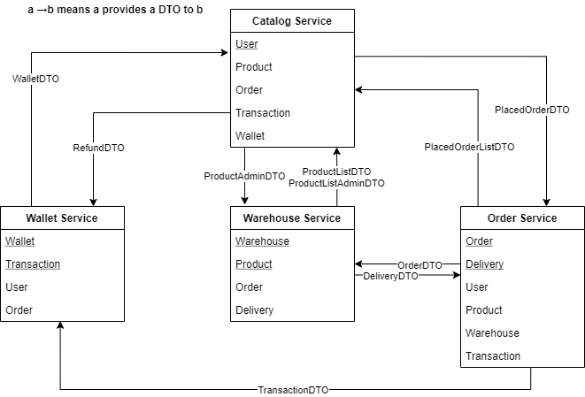

# eCommerce API 
#### Advanced programming project of the Master in AI & Cloud - PoliTO Reply

eCommerce APi is an headless (just API) eCommerce web application powered by Spring boot, with a microservice architecture.

## Services
### Description
The application is composed by the following services.
#### Catalog Service
Customers interact with this service only. They can list products, get
their features and availability (availability comes from warehouses)
To each user we associate a wallet they can use to purchase products
Customer can place any order, given there is enough money in their
wallet and the products are available in the warehouses. As result they
receive and Order object with a tracking id they can use to check the
status or cancel the order until shipping is not started.
Customers also receive an email each time their order is updated
Admins can add and edit product properties
Both Customers and Admins already have an account using their email
is the username. For simplicity this is the only service handling
authentication.
#### Order Service
It is the core of the system. It stores orders and their status and it is responsible
of enforcing the rules on orders.
Orders can be placed only if the customer has enough money in his/her wallet
and products are available in warehouses. Order placing and all the related
operations should be atomically isolated at a global level and be transactional,
i.e. if some service fails, for any reason, every other operation already done must
be rolled back (see later for details).
After the purchase, the order status must be updated accordingly to the
progress (picked up from the warehouse, shipping in progress, shipped,
canceled, error - you can choose any set of states useful for modeling order
handling) and admins and users must be notified via an email
In case of fail or when an order is canceled the customer must be rechargeed and
the items must be returned to the warehouse.
This service APIs can be used only by other internal services (all services are
considered trusted and they can perform any operation)
Customers and Admins can query and modify order status only through the the
CatalogService accordingly to their permissions.
#### Wallet Service
Wallets handle customer money, they have simple API: you can
query the total, the transaction list, and add a transaction.
Negative transaction are issued during purchase, positive ones
(recharges) are issued by admins only.
#### Warehouse Service
It handles the list of products stored in any warehouse.
Products can be in more than one warehouse, with different
quantities
Each warehouse has list of alarm levels for any product; when
the quantity of product is below the alarm level a notification
must be sent to the admins
The APIs allows the listing of products and their quantities,
loading and unloading items and updating alarms.
For simplicity you can use a single WarehouseService handling
more than one warehouse, but in real life there can a separate
instance for each warehouse.

### Communication
The following image reports how the communication among the microservices take places and which data are exchanged.
For each microservice, there are reported the classes that are defined in the microservice itself (<ins>underlined</ins>), and the classes that are needed from other services, defined as DTOs. 



### Endpoints
#### Catalog service endpoints
|EP|Payload| Description|
|---|---|---|
|`GET /catalog/products/show`| response: ProductListDTO |Shows the catalog (the same for all users)|
|`GET /catalog/products/admin/show`| response: ProductAdminListDTO |Shows the catalog for an admin user with warehouse information|
|`POST /catalog/products/admin`| request: ProductAdminDTO response: ProductDTO |Admin adds a product specifying the warehouse|
|`PUT /catalog/products/admin/{productID}`| request: ProductAdminDTO response: ProductDTO |Admin modify information of an existing product (eventually updating the alarm level)|
|`GET /catalog/orders/{userID}`| response: ShownOrderListDTO |Shows the orders associated with `userID`|
|`POST /catalog/orders/{userID}`| request: PlacedOrderDTO |Create an order for the `userID` user with the details specified in `PlacedOrderDTO`|
|`GET /catalog/orders/delete/{orderID}`| response: OrderDTO |Cancel an order `orderID` for the currently logged user (update its STATUS)|
|`GET /catalog/wallet/{userID}`| response: WalletDTO |Retrieve the wallet information (total and transaction list) for the currently logged user|
|`POST /catalog/wallet/admin/recharge/{userID}`| request: RechargeDTO |Recharge the user specified in `userID`|
#### Wallet service endpoints
|EP|Payload| Description|
|---|---|---|
|`POST /wallet/create`| request: UserDTO response: WalletID|Catalog creates a new user so that Wallet can create a correspondent entry|
|`POST /wallet/{userID}`| request: TransactionDTO response: TransactionID|Order insert a new transaction in the `userID`'s wallet|
|`POST /wallet/checkavailability/{userID}`| request: TransactionDTO response: OrderID|Order checks for availability to start a new order on `userID`'s wallet|
|`GET /wallet/performtransaction/{orderID}`| request: TransactionID |Order insert a new transaction previously checked.|
|`GET /wallet/{userID}`| response: WalletDTO|Catalog requests`userID`'s wallet and transaction list|
|`POST /wallet/recharge/{userID}`| request: RechargeDTO|Catalog insert in the `userID`'s wallet a recharge|
|`GET /wallet/undo/{orderID}`| request: orderID response: transactionID| OrderService refund an order performing a rollback on the transaction.|
#### Warehouse service endpoints
|EP|Payload| Description|
|---|---|---|
|`GET /warehouse/products/totals`| response: ProductListDTO |Catalog requests a list of products (overall quantity)|
|`GET /warehouse/products/perwarehouse`| response: ProductAdminListDTO |Catalog requests a list of products (for each warehouse) |
|`POST /warehouse/products`| request: ProductAdminDTO response: ProductDTO |Catalog insert a new product in a specific warehouse |
|`POST /warehouse/products/update/{productID}`| request: ProductAdminDTO response: ProductDTO |Catalog modifies a product in a specific warehouse (eventually updating the alarm level) |
|`POST /warehouse/orders`| request: OrderDTO response: DeliveryListDTO |Order request a new order and receives a list of deliveries|
|`GET /warehouse/orders/restore/{orderID}`| response: orderID |Order deletes a previously requested order (it has been canceled by the user) |
#### Order service endpoints
|EP|Payload| Description|
|---|---|---|
|`POST /order/orders/`| request: PlacedOrderDTO response: OrderDTO|Catalog insert a new order. The newly created order is returned, having STATUS PAID or FAILED|
|`GET /order/{userID}/orders`| response: ShownOrderListDTO |Catalog requests the orders of `userID`|
|`GET /order/orders/{orderID}`| response: ShownOrderDTO |Catalog requests the order `orderID`|
|`GET /order/delete/{orderID}`| response: OrderDTO |Catalog requests to cancel the order `orderID` (updating its STATUS, if it has not been shipped yet)|

### DTOs definition
```
WalletDTO(UserDTO, total, List<Transaction>, ??time??)
ProductDTO(name, description, category, picture, currentPrice)
ProductAdminDTO(ProductDTO, WarehouseDTO, alarm level, warehouseQuantity)
ProductListDTO(Dict<ProductDTO, totalQuantity>)
ProductListAdminDTO(List<ProductAdminDTO>)

UserDTO(userID, name, surname, email, role)
PurchaseDTO(ProductDTO, quantity, sellingPrice)
TransactionDTO(UserDTO, amount, time, causale, status)
RechargeDTO(UserDTO, amount, time, causale,??UserDTO(who charges)??)
WarehouseDTO(name, address)

OrderDTO(OrderID, List<PurchaseDTO>, status)
DeliveryDTO(WarehouseDTO, List<PurchaseDTO>)
DeliveryListDTO(OrderDTO, List<DeliveryDTO>)

PlacedOrderDTO(UserDTO, List<PurchaseDTO>, deliveryAddress)
ShownOrderDTO(List<OrderDTO>)
ShownOrderListDTO(List<List<OrderDTO>)
```
### Http Response code
Always catched:
- ResourceAccessException if the remote service is not reachable
- 500 Internal_Server_error if the remote service got an internal exception

#### Warehouse service endpoints
|EP|Http Status Code| Description|
|---|---|---|
|`GET /warehouse/products/totals`| 200 OK |Everything goes ok, the product list is returned (can be empty)|
|`GET /warehouse/products/perwarehouse`| 200 OK |Everything goes ok, the product list per-warehouse is returned (can be empty)|
|`POST /warehouse/products`| 200 OK |Everything goes ok,the product is inserted in the database |
|`POST /warehouse/products`| 409 CONFLICT | The product already exists in the database |
|`PUT /warehouse/products/{productID}`| 200 OK |Everything goes ok,the product is modified in the database |
|`PUT /warehouse/products/{productID}`| 404 NOT_FOUND | The product or the warehouse doesn't exists |
|`POST /warehouse/orders`| 200 OK | Everything goes ok, the list of deliveries is retrieved |
|`POST /warehouse/orders`| 409 CONFLICT |One or more products are not available|
|`GET /warehouse/orders/restore/{orderID}`| 200 OK | Everything goes ok, the products are restored |

#### Order service endpoints
|EP|Payload| Description|
|---|---|---|
|`POST /order/orders/`| 200 OK |Everything goes ok, the order is paid and deliveries are scheduled|
|`POST /order/orders/`| 402 PAYMENT_REQUIRED |There is not enough money (failed in STEP 1 or STEP 3)|
|`POST /order/orders/`| 409 CONFLICT | There aren't enough products (failed in STEP 2)|
|`GET /order/{userID}/orders`| 200 OK |Everything goes ok, the orders of the user are returned (can be empty)|
|`GET /order/orders/{orderID}`| 200 OK |Everything goes ok, the orders is returned |
|`GET /order/orders/{orderID}`| 404 NOT_FOUND | The order doesn't exist |
|`GET /order/delete/{orderID}`|  200 OK |Everything goes ok, the order is canceled  |
|`GET /order/delete/{orderID}`|  402 PAYMENT_REQUIRED |The refund goes wrong  |
|`GET /order/delete/{orderID}`|  409 CONFLICT | The products restoring goes wrong  |
|`GET /order/delete/{orderID}`|  404 NOT_FOUND |The order doesn't exist  |

#### Wallet service endpoints
|EP|Payload| Description|
|---|---|---|
|`POST /wallet/create`| 200 OK |Everything goes ok, the wallet for the user is created |
|`POST /wallet/{userID}`| 200 OK |Everything goes ok, the wallet of the user is retrieved|
|`POST /wallet/{userID}`| 404 NOT_FOUND | The wallet doesn't exists for the user|
|`POST /wallet/checkavailability/{userID}`| 200 OK |Everything goes ok, the user has the correct amount of money in the wallet|
|`POST /wallet/checkavailability/{userID}`| 409 CONFLICT | The user hasn't enough money |
|`POST /wallet/checkavailability/{userID}`| 404 NOT_FOUND | The wallet doesn't exists for the user|
|`GET /wallet/performtransaction/{transactionID}`| 200 OK |Everything goes ok, the transaction is confirmed|
|`GET /wallet/performtransaction/{transactionID}`| 404 NOT_FOUND | The transaction doesn't exist|
|`GET /wallet/performtransaction/{transactionID}`| 409 CONFLICT | The transaction is not confirmed|
|`GET /wallet/{userID}`| 200 OK |Everything goes ok, the wallet information are retrieved|
|`GET /wallet/{userID}`|404 NOT_FOUND | The wallet doesn't exists for the user|
|`POST /wallet/recharge/{userID}`| 200 OK |Everything goes ok, the wallet is recharged|
|`POST /wallet/recharge/{userID}`| 404 NOT_FOUND | The wallet doesn't exists for the user|
|`GET /wallet/undo/{orderID}`| 404 NOT_FOUND | The order doesn't exists|
|`GET /wallet/undo/{orderID}`| 200 OK| The order has been refunded|


### Operation repository
It must contain:
- saga identifier
- information for performing rollback (i.e. current status)
- timestamp (optional)